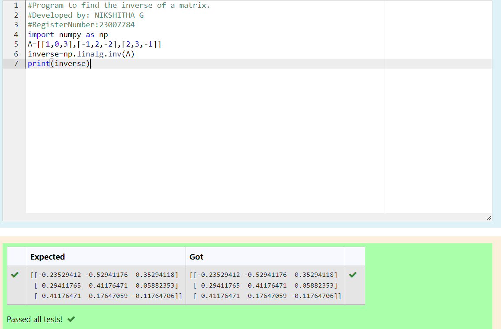

# INVERSE-OF-A-MATRIX
## Aim:
To write a python program to find the inverse of a matrix
## Equipment’s required:
1. 	Hardware – PCs
2. 	Anaconda – Python 3.7 Installation / Moodle-Code Runner
## Algorithm:
### Step1 : 
Import numpy
### Step 2:
Define the matrix 
### Step 3: 
Calculate the inverse using np.linalg.inv(A)
### Step 4: 
Print the result.
## Program:
```PYTHON
#Program to find the inverse of a matrix.
#Developed by: NIKSHITHA G
#RegisterNumber:23007784
import numpy as np
A=[[1,0,3],[-1,2,-2],[2,3,-1]]
inverse=np.linalg.inv(A)
print(inverse)
```
## Output:

## Result:
Thus the inverse of given matrix is successfully solved using python program

